# lab2-SQL Murder Mystery-BryanMedrano

Este proyecto corresponde a la resolución del ejercicio interactivo **SQL Murder Mystery**, cuyo objetivo es resolver un caso de asesinato utilizando consultas SQL para investigar una base de datos relacional.

A través de diferentes pistas, entrevistas y registros almacenados en varias tablas, se realiza un proceso de investigación para identificar al **asesino** y posteriormente a la **persona que organizó el crimen**.

🔎 Reto SQL Murder Mystery: https://mystery.knightlab.com/

---

## Objetivo del laboratorio

El objetivo de este ejercicio es practicar el uso de consultas SQL para:

- Filtrar información en bases de datos
- Relacionar datos entre diferentes tablas
- Interpretar pistas dentro de registros
- Aplicar lógica de investigación usando SQL

Durante la investigación se consultaron tablas como:

- `crime_scene_report`
- `person`
- `interview`
- `drivers_license`
- `get_fit_now_member`
- `facebook_event_checkin`

---

## Metodología

La resolución del caso se realizó mediante una serie de consultas SQL documentadas paso a paso.  
Cada consulta permitió obtener nuevas pistas que llevaron a identificar:

1. A los testigos del crimen
2. Al sospechoso principal
3. Al asesino
4. A la persona que organizó el asesinato

Las consultas utilizadas se encuentran documentadas en la carpeta "consultas/respuestas.sql"
___

# 🕵️ SQL Murder Mystery

## Detective: Bryan Medrano

## Resumen del Caso

El 15 de enero de 2018, SQL City despertó con una escena del crimen que conmocionó a toda la ciudad: un asesinato meticulosamente ejecutado cuya única evidencia inicial era un video de una cámara de seguridad que captó a dos testigos clave.

La investigación se llevó a cabo analizando diferentes tablas de la base de datos mediante consultas SQL hasta poder identificar al sospechoso.

---

## Bitácora de Investigación

### **1. Revisión del reporte del crimen**

La investigación la comencé consultando la tabla `crime_scene_report`
para encontrar el asesinato ocurrido el **15 de enero de 2018 en SQL City**.

```sql
SELECT * FROM crime_scene_report
WHERE date = 20180115 AND city = 'SQL City' AND type = 'murder';
```

**Evidencia**

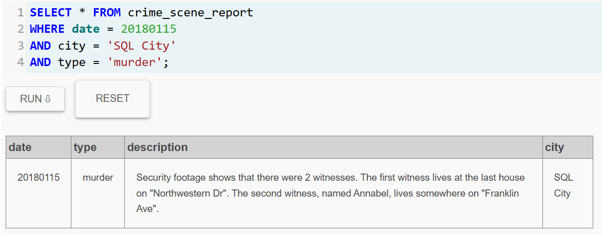

> **Conclusión**\
> El reporte del crimen reveló información importante. 
> Las cámaras de seguridad mostraron que existieron dos testigos del crimen:\
El *primer testigo* vivía en ***la última casa de Northwestern Dr.***\
El *segundo testigo* se llamaba ***Annabel y vive en Franklin Ave.*** 
> 
> Estas pistas permitieron continuar la investigación buscando a estas dos personas en la base de datos.

### Siguiendo con la investigación

Ahora debemos encontrar al **primer testigo**.

La pista dice que vive en la ultima casa de Northwestern Dr.
___

### **2. Identificación del primer testigo**

El reporte indicaba que el primer testigo vivía en ***la última casa de Northwestern Dr***. Para encontrar a esta persona, se buscó en la tabla `person` filtrando por esa calle y ordenando el número de direcciones de mayor a menor para obtener la casa con el número más alto.

```sql
SELECT * FROM person
WHERE address_street_name = 'Northwestern Dr'
ORDER BY address_number DESC
LIMIT 1;
```

**Evidencia**

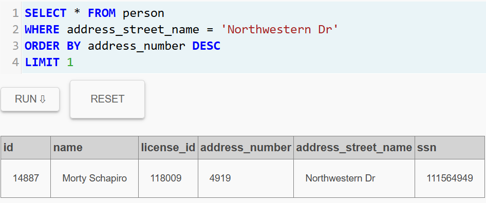

> **Conclusión:**\
>La consulta permitió identificar al primer testigo:\
>Nombre: Morty Schapiro\
>Dirección: 4919 Northwestern Dr
>
Con esta información, seguimos con la investigación, ahora tocaba revisar si esta persona ha dado alguna declaración sobre el caso.
___

### **3. Entrevista del primer testigo**

Después de identificar al primer testigo, se consultó en la tabla `interview`
para revisar su declaración sobre lo ocurrido.

```sql
SELECT * FROM interview
WHERE person_id = 14887;
```
**Evidencia**

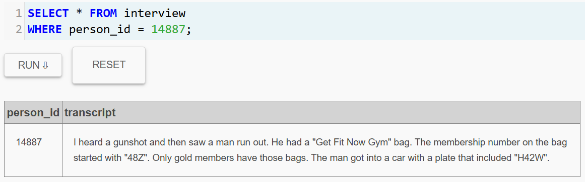

> **Conclusión:**\
El testigo declaró haber escuchado un disparo y luego vio a un hombre salir corriendo de la escena del crimen.\
La declaración reveló varias pistas importantes:
>
>- El sospechoso llevaba una bolsa del gimnasio "Get Fit Now Gym".
>- El número de membresía del gimnasio comenzaba con "48Z".
>- Solo los miembros Gold tienen ese tipo de bolsa.
>- El sospechoso escapó en un automóvil cuya placa contenía "H42W".

A partir de la declaración del primer testigo, se obtuvieron varias pistas que sugieren que el sospechoso podría ser miembro del gimnasio **Get Fit Now**. 

Sin embargo, antes de comenzar a buscar posibles sospechosos dentro de las membresías del gimnasio, resulta conveniente analizar la declaración del **segundo testigo mencionado en el reporte del crimen**. Según el reporte, esta persona se llamaba ***Annabel*** y vivía en ***Franklin Ave***. 

Por lo tanto, el siguiente paso de nuestra investigación consistió en localizar a Annabel en la base de datos de personas para revisar si proporcionó alguna declaración relevante sobre el caso.
___

### **4. Identificación del segundo testigo**

El reporte indicaba que esta persona se llamaba **Annabel** y vivía en **Franklin Ave**, por lo que el siguiente paso fue buscar en la base de datos de personas a alguien con ese nombre que residiera en esa calle. 

Para localizarla dentro de la base de datos se ejecutó la siguiente consulta:

```sql
SELECT *
FROM person
WHERE address_street_name = 'Franklin Ave'
AND name LIKE '%Annabel%';
```

**Evidencia**

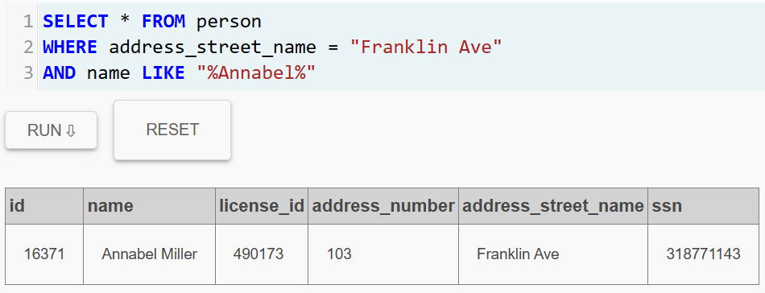

> **Conclusión:**\
La consulta permitió identificar a la segunda testigo:\
**Nombre:** Annabel Miller  
**Dirección:** 103 Franklin Ave  

Una vez identificada, procedí a revisar si había dado alguna entrevista que pudiera aportar nuevas pistas para la investigación.
___

### **5. Entrevista del segundo testigo**

Luego de identificar a ***Annabel Miller*** como el segundo testigo del caso, decidí revisar su entrevista para obtener más información sobre el asesinato.

```sql
SELECT * FROM interview
WHERE person_id = 16371;
```

**Evidencia**

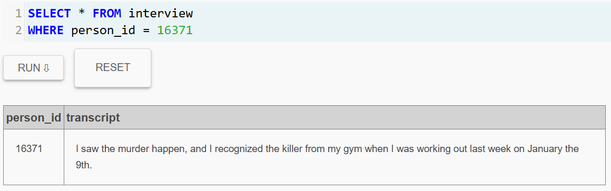

> **Conclusión:**\
La consulta permitió identificar a la segunda testigo:\
**Nombre:** Annabel Miller  
**Dirección:** 103 Franklin Ave  
En su declaración, Annabel afirmó haber presenciado el asesinato y mencionó que reconoció al asesino del gimnasio al que asiste. También indicó que lo había visto entrenando allí la semana anterior, específicamente el 9 de enero.

Esta información reforzó la pista obtenida en la declaración del primer testigo, quien mencionó que el sospechoso llevaba una bolsa del gimnasio Get Fit Now Gym.

Con ambas declaraciones apuntando al mismo lugar, decidí enfocar la investigación en los miembros del gimnasio Get Fit Now para intentar identificar al sospechoso.
___

### **6. Búsqueda de sospechosos en el gimnasio**

A partir de las declaraciones de los testigos, ambas pistas apuntaban al gimnasio **Get Fit Now**.  
El primer testigo mencionó que el sospechoso llevaba una bolsa de este gimnasio y que el número de membresía comenzaba con **"48Z"**, además de que solo los miembros **Gold** poseen ese tipo de bolsa.

Con esta información decidí buscar en la tabla `get_fit_now_member` a los miembros que cumplieran estas características.

```sql
SELECT * FROM get_fit_now_member
WHERE id LIKE '%48Z%'
AND membership_status = 'gold';
```

**Evidencia**

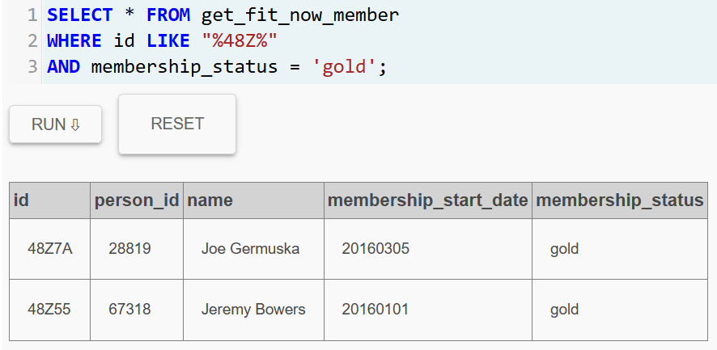

> **Conclusión:**\
La consulta redujo la lista de posibles sospechosos a dos personas:\
***Joe Germuska***\
***Jeremy Bowers***\
Ambos son miembros Gold del gimnasio y sus números de membresía coinciden con el patrón mencionado por el primer testigo.

El siguiente paso de la investigación fue determinar cuál de estos dos sospechosos coincidía con la pista del vehículo cuya placa contenía "H42W".

Pero primero necesitamos encontrar **las licencias de estas dos personas**.
___

### **7. Obtención de licencias de los sospechosos**

Después de reducir la lista de posibles sospechosos a ***Joe Germuska*** y ***Jeremy Bowers***, el siguiente paso fue obtener sus números de licencia de conducir para poder revisar los vehículos asociados a cada uno.

Para ello ejecuté la siguiente consulta en la tabla `person`:

```sql
SELECT * FROM person
WHERE id = 28819 OR id = 67318;
```

**Evidencia**

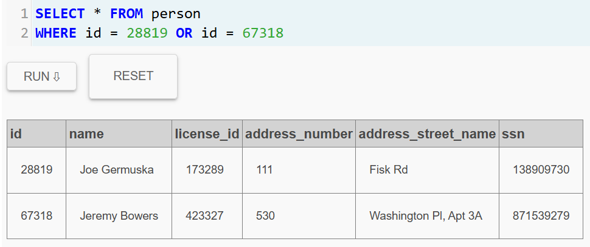

> **Conclusión:**\
La consulta permitió obtener los números de licencia de ambos sospechosos:\
***Joe Germuska***: license_id = 173289\
***Jeremy Bowers***: license_id = 423327

Con esta información, el siguiente paso fue revisar la tabla drivers_license para identificar cuál de los dos tenía un vehículo cuya placa coincidiera con la pista "H42W" mencionada por el primer testigo.
___

### **8. Verificación de las placas de los sospechosos**

Luego de obtener los números de licencia de ***Joe Germuska*** y ***Jeremy Bowers***, el siguiente paso fue revisar la tabla `drivers_license` para verificar qué vehículo estaba asociado a cada uno.

```sql
SELECT * FROM drivers_license
WHERE id = 173289 OR id = 423327;
```

**Evidencia**

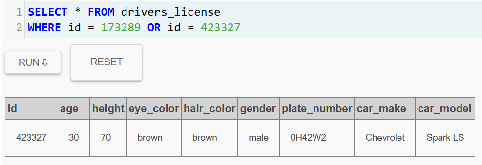

> **Conclusión:**\
Al revisar los resultados, observé que el vehículo asociado a ***Jeremy Bowers*** tenía la placa: 0H42W2\
Esta placa contiene la secuencia "H42W", que coincide con la pista proporcionada por el primer testigo.

Con esta evidencia, se pudo identificar a Jeremy Bowers como el principal sospechoso del asesinato.

___

### **9. Verificación del culpable**

Después de analizar todas las pistas recolectadas durante la investigación, concluí que ***Jeremy Bowers*** era el responsable del asesinato. Para confirmar esta hipótesis, utilicé la consulta de verificación proporcionada por la plataforma.

```sql
INSERT INTO solution VALUES (1, 'Jeremy Bowers');
    SELECT value FROM solution;
```

**Evidencia**

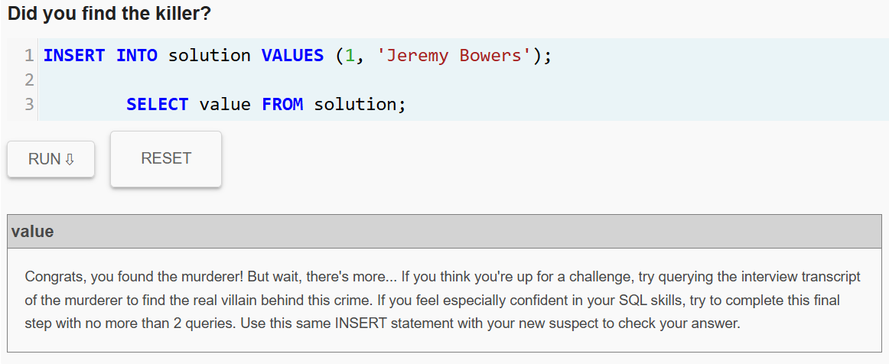

> **Conclusión:**\
Esto confirmó que Jeremy Bowers era el asesino, pero también reveló que podría existir un autor intelectual detrás del crimen.

Por esta razón, el siguiente paso de la investigación consistió en revisar la entrevista de Jeremy Bowers para descubrir quién pudo haberlo contratado para cometer el asesinato.

___

### **10. Entrevista del asesino**

Una vez identificado **Jeremy Bowers** como el responsable del asesinato, decidí revisar su entrevista para determinar si había actuado por cuenta propia o si alguien más había organizado el crimen.

```sql
SELECT * FROM interview
WHERE person_id = 67318;
```

**Evidencia**

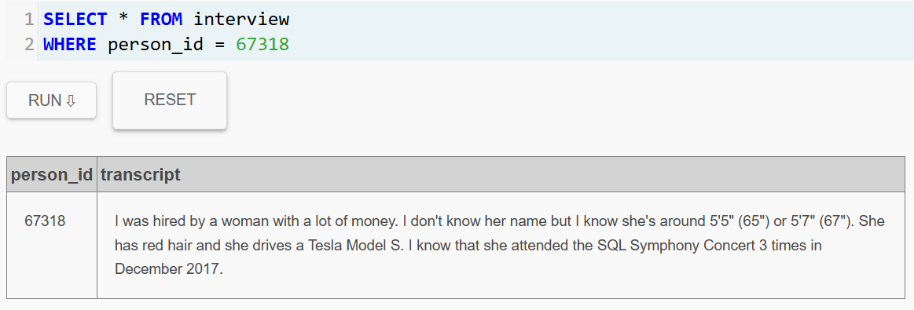

> **Conclusión:**\
En su declaración, Jeremy confesó que fue contratado para cometer el asesinato por una mujer adinerada. Aunque no conocía su nombre, proporcionó varias pistas importantes sobre ella:
>
>- Es una mujer
>- Mide aproximadamente entre  5'5" (65") y 5'7" (67")
>- Tiene cabello rojo
>- Conduce un Tesla Model S
>- Asistió tres veces al evento "SQL Symphony Concert" en diciembre de 2017

Con esta información, el siguiente paso de la investigación fue buscar en la base de datos a una persona que coincidiera con todas estas características.

___

### **11. Búsqueda de la posible autora intelectual**

Según la declaración de ***Jeremy Bowers***, la persona que lo contrató tenía las siguientes características:

- Mujer
- Cabello rojo
- Altura entre **65 y 67 pulgadas**
- Conducía un **Tesla Model S**

Para encontrar posibles coincidencias en la base de datos, consulté la tabla `drivers_license` filtrando por estas características.

```sql
SELECT * FROM drivers_license
WHERE gender = 'female'
AND hair_color = 'red'
AND height BETWEEN 65 AND 67
AND car_make = 'Tesla';
```

**Evidencia**

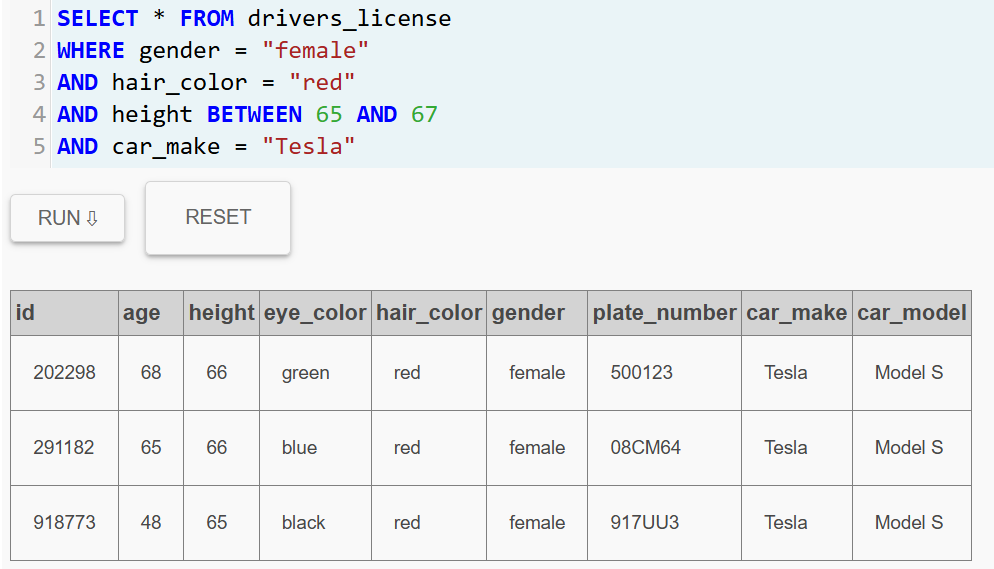

> **Conclusión:**\
La consulta devolvió tres posibles sospechosas que coinciden con las características descritas:\
***Licencia 202298***\
***Licencia 291182***\
***Licencia 918773***

Sin embargo, ***Jeremy*** también mencionó que esta persona asistió tres veces al evento **"SQL Symphony Concert"** en **diciembre de 2017**, por lo que el siguiente paso fue investigar los registros de asistencia a este evento para identificar cuál de estas personas cumple con esa condición.

___

### **12. Identificación de las posibles sospechosas**

Luego de filtrar en la tabla `drivers_license`, obtuve tres registros que coincidían con las características descritas por Jeremy Bowers.  

Para conocer la identidad de estas personas, consulté la tabla `person` utilizando los `license_id` encontrados previamente.

```sql
SELECT * FROM person
WHERE license_id IN (202298, 291182, 918773);
```

**Evidencia**

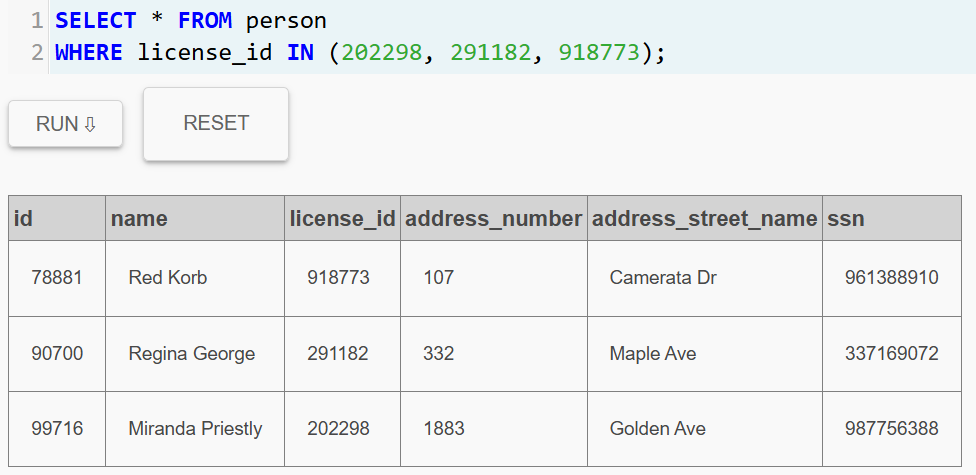

> **Conclusión:**\
La consulta permitió identificar a las tres posibles sospechosas:
>
>- ***Red Korb***
>- ***Regina George***
>- ***Miranda Priestly***

Sin embargo, aún faltaba verificar la última pista proporcionada por ***Jeremy***:
la persona que lo contrató asistió tres veces al evento **"SQL Symphony Concert"** en **diciembre de 2017**.

Por esta razón, el siguiente paso de la investigación fue revisar los registros de asistencia a este evento para determinar cuál de estas tres personas cumple con esa condición.

___

### **13. Identificación de la autora intelectual**

Según la confesión de ***Jeremy Bowers***, la persona que lo contrató asistió **tres veces al evento "SQL Symphony Concert" en diciembre de 2017**.

Para verificar esta información, consulté la tabla `facebook_event_checkin` filtrando por las tres posibles sospechosas identificadas anteriormente.

```sql
SELECT * FROM facebook_event_checkin
WHERE person_id IN (78881, 90700, 99716)
AND event_name = 'SQL Symphony Concert'
AND date BETWEEN 20171201 AND 20171231;
```

**Evidencia**

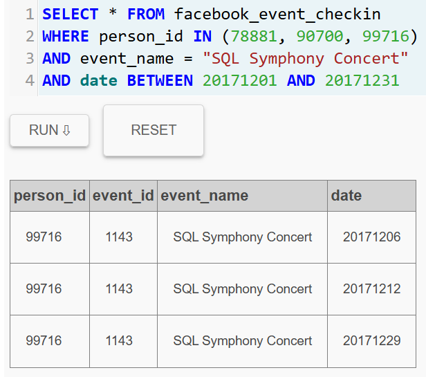

> **Conclusión:**\
Los resultados mostraron que solo una persona asistió tres veces al evento en diciembre de 2017: ***Miranda Priestly*** (person_id = 99716)

Esto coincide exactamente con la información proporcionada por Jeremy Bowers, lo que permite concluir que ***Miranda Priestly*** fue la persona que organizó el asesinato y contrató a *Jeremy* para cometer el crimen.

___

### **14. Verificación final del caso**

Después de identificar a **Miranda Priestly** como la persona que organizó el asesinato, utilicé la consulta de verificación proporcionada por la plataforma para confirmar la solución final.

```sql
INSERT INTO solution VALUES (1, 'Miranda Priestly');
SELECT value FROM solution;
```

**Evidencia**

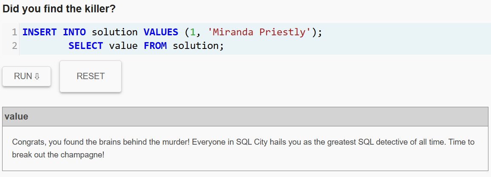

### **Conclusión del caso**

A través del análisis de múltiples tablas y el cruce de información entre testigos, registros de membresías, licencias de conducir y eventos, se logró resolver el caso del asesinato ocurrido el **15 de enero de 2018 en SQL City**.

La investigación permitió identificar que:

- **Jeremy Bowers** fue el ejecutor del asesinato.
- **Miranda Priestly** fue la autora intelectual que contrató a Jeremy para cometer el crimen.

Este proceso demostró cómo el uso de consultas SQL permite explorar bases de datos relacionales, conectar información entre diferentes tablas y resolver problemas complejos mediante el análisis de datos.

___

> [!note]
> Este README fue elaborado con apoyo de herramientas de Inteligencia Artificial como asistente de redacción y estructuración.  
> Todo el trabajo ha sido validado y ajustado mediante intervención humana (Bryan Medrano) para asegurar su precisión técnica y coherencia. Aun así, es posible que existan errores o aspectos susceptibles de mejora.
